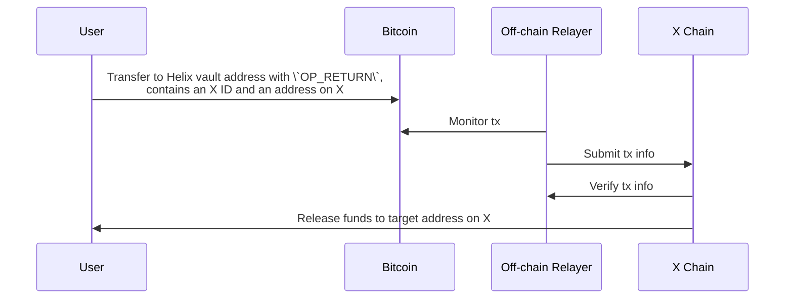

# Helix BTC Bridge

## Introduction

This project facilitates cross-chain fund transfers from **Bitcoin** to **X** chain.

It is built using three main components:
- User Interface (UI)
- Off-chain Relayer
- X Chain Contract

### Technical Architecture

## Component Overview

### UI

TODO.

### Relayer

TODO.

### Contract

TODO.

## License

State the type of license the project is under, [GPL-3.0](./LICENSE).
